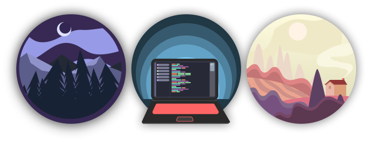
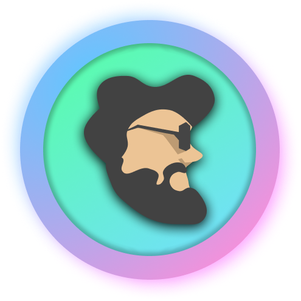

### 
Im Yash Giri, a full stack developer seasoned in robotics and circuits

- 🦾Im currently working at Witblox

- 🌱I have a YouTube channel for programming

- ❓I am currently learning React

- ⚡ Fun fact: I have a long running project to make an 8 bit computer out of transistors.

 

## My Skill Set

### Things I Know

  
      
      
      
      
      
      
      
      
      
      
      
      
      
      
      
      
      
      
      
      
      
      
      
      
      
      
      

 

## Connect with me

    
    
    
      

 

## Github Stats

 

 

    

 

    

 

---

    

